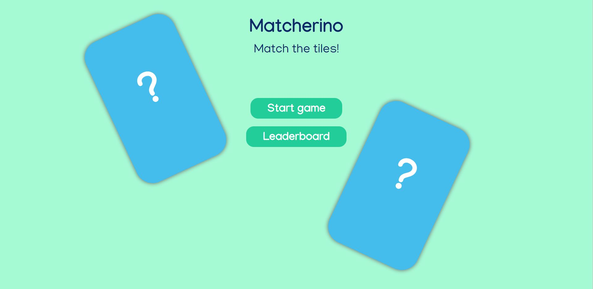
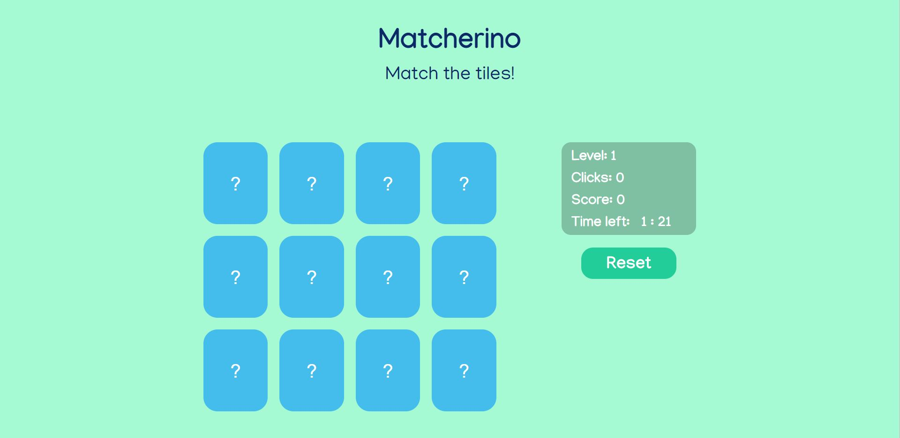
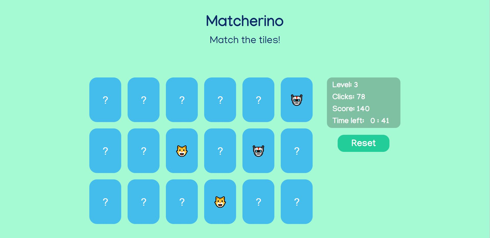
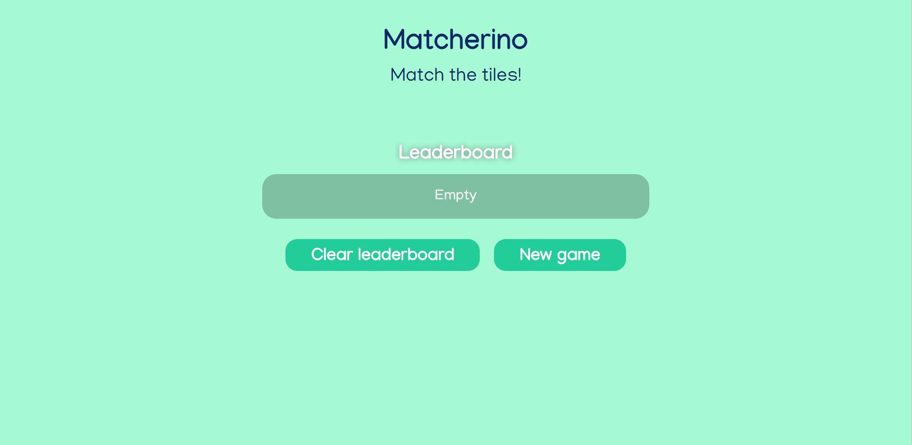
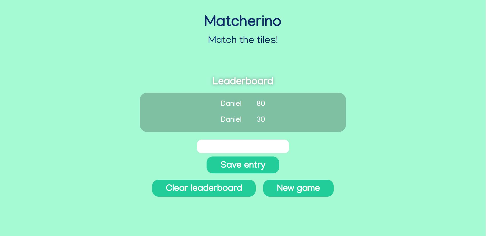
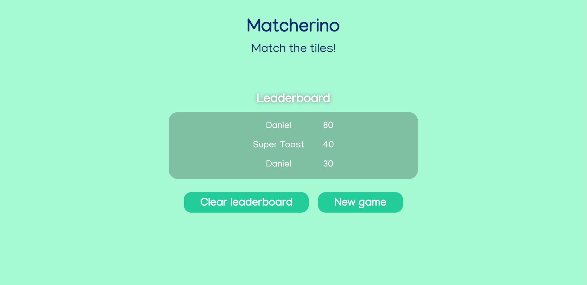
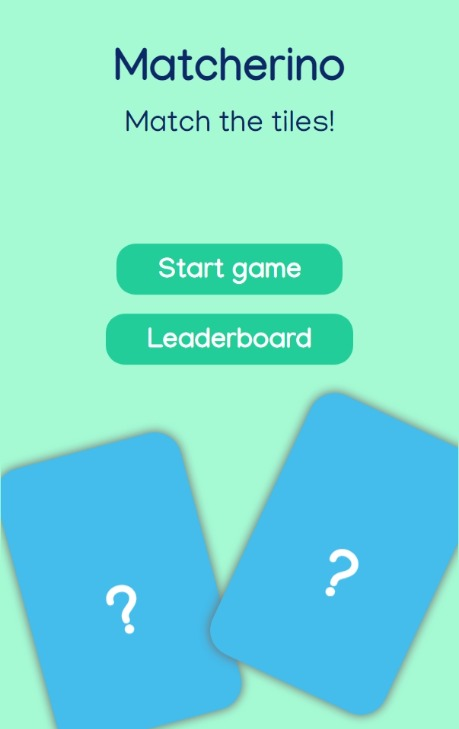
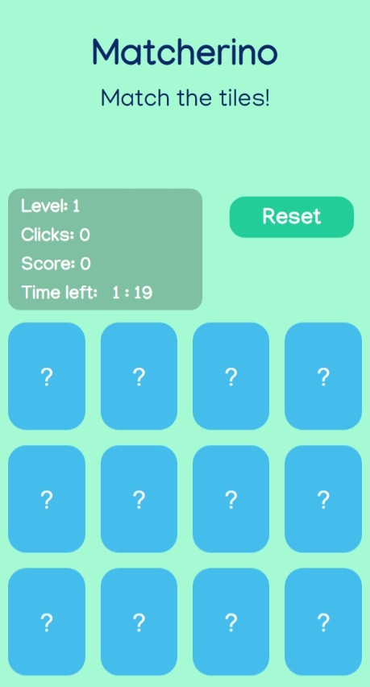

# matcherino
 Match 2 tiles to score points

 Matcherino is an app where the user needs to match 2 tiles with the same emoji. The emojis are hidden and are revealed when the user clicks on a tile. If the user completes the board, a new one is generated and after a few levels the tiles number is increased. At the end, the user is given the option to save the score along with a username which can be typed by the player. The leaderboard can also be accessed from the main menu and in the leaderbard section there is also an option to clear the entries.
 

img1 represents the main menu while img2 and img3 show the game section

img4 shows th empty leaderboard (if there is no saved entry or if the leaderboard was cleared)

img5 shows the leaderboard section after a game was finished and the user can enter its his name, while img6 shows the leaderboard after the entry was saved (the leaderboard also filters the entries by the score in a descending order)

img7 and img8 represent the mobile layout of the main menu and game section

